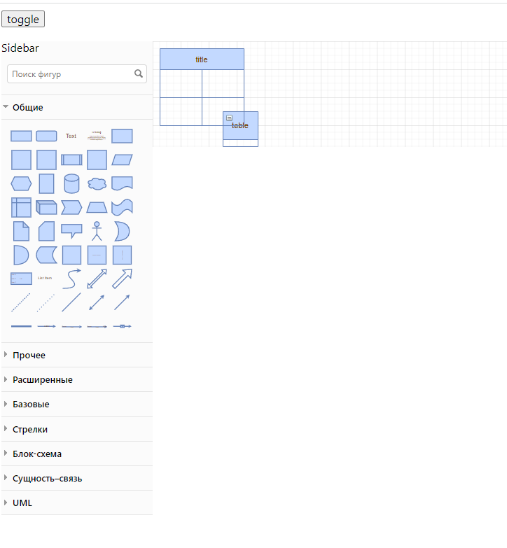

## The integration for full draw io editor into react project

##### Usage:
```git clone --recurse-submodules https://github.com/teranich/drawio-react-integration.git```

```yarn install```
```yarn start```


---
**Clone git submodule into project**

If 'public\drawio' has been daleted you can fetch it again
```git submodule update --init --recursive```

---


